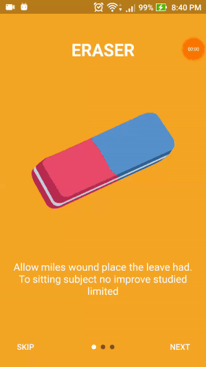
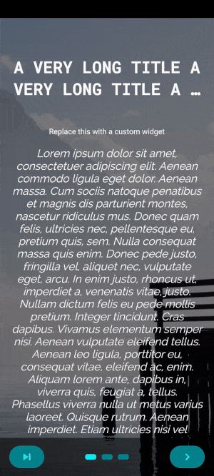
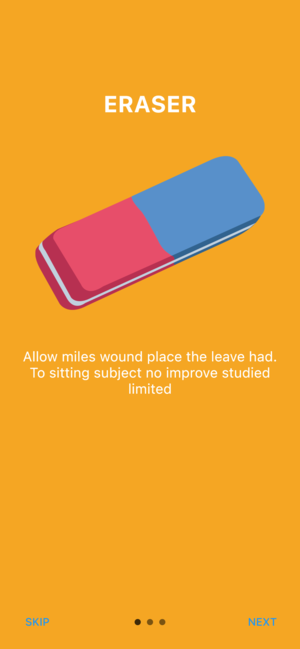
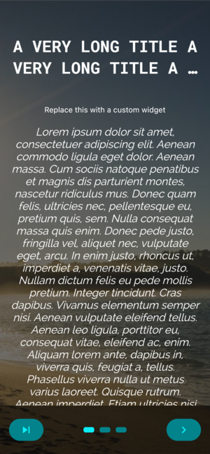

<h1 align="center">FLUTTER INTRO SLIDER</h1>

<p align="center">A plugin to help you make intro screens to show the major features of your app. You can change the image, button, text style, color and more things. Create intro screens is never been more quick and easy than this</p>

Add to pubspec.yaml file

```sh
dependencies:
  intro_slider: ^1.0.6
```

Import

```sh
import 'package:intro_slider/intro_slider.dart';
```

<h2 align="center">Demo</h2>

 | 

<h2 align="center">Example</h2>

### Default config



```dart
class _MyAppState extends State<MyApp> {
  List<Slide> slides = new List();

  @override
  void initState() {
    super.initState();

    slides.add(
      new Slide(
        title: "ERASER",
        description: "Allow miles wound place the leave had. To sitting subject no improve studied limited",
        pathImage: "images/photo_eraser.png",
        backgroundColor: 0xfff5a623,
      ),
    );
    slides.add(
      new Slide(
        title: "PENCIL",
        description: "Ye indulgence unreserved connection alteration appearance",
        pathImage: "images/photo_pencil.png",
        backgroundColor: 0xff203152,
      ),
    );
    slides.add(
      new Slide(
        title: "RULER",
        description:
            "Much evil soon high in hope do view. Out may few northward believing attempted. Yet timed being songs marry one defer men our. Although finished blessing do of",
        pathImage: "images/photo_ruler.png",
        backgroundColor: 0xff9932CC,
      ),
    );
  }

  void onDonePress() {
    // TODO: go to next screen
  }

  void onSkipPress() {
    // TODO: go to next screen
  }

  @override
  Widget build(BuildContext context) {
    return new IntroSlider(
      slides: this.slides,
      onDonePress: this.onDonePress,
      onSkipPress: this.onSkipPress,
    );
  }
}
```

### Custom config



```dart
class _MyAppState extends State<MyApp> {
  List<Slide> slides = new List();

  @override
  void initState() {
    super.initState();

    slides.add(
      new Slide(
        title: "SCHOOL",
        styleTitle:
            TextStyle(color: Color(0xffD02090), fontSize: 30.0, fontWeight: FontWeight.bold, fontFamily: 'RobotoMono'),
        description: "Allow miles wound place the leave had. To sitting subject no improve studied limited",
        styleDescription:
            TextStyle(color: Color(0xffD02090), fontSize: 20.0, fontStyle: FontStyle.italic, fontFamily: 'Raleway'),
        pathImage: "images/photo_school.png",
        backgroundColor: 0xFFFFDEAD,
      ),
    );
    slides.add(
      new Slide(
        title: "MUSEUM",
        styleTitle:
            TextStyle(color: Color(0xffD02090), fontSize: 30.0, fontWeight: FontWeight.bold, fontFamily: 'RobotoMono'),
        description: "Ye indulgence unreserved connection alteration appearance",
        styleDescription:
            TextStyle(color: Color(0xffD02090), fontSize: 20.0, fontStyle: FontStyle.italic, fontFamily: 'Raleway'),
        pathImage: "images/photo_museum.png",
        backgroundColor: 0xffFFFACD,
      ),
    );
    slides.add(
      new Slide(
        title: "COFFEE",
        styleTitle:
            TextStyle(color: Color(0xffD02090), fontSize: 30.0, fontWeight: FontWeight.bold, fontFamily: 'RobotoMono'),
        description:
            "Much evil soon high in hope do view. Out may few northward believing attempted. Yet timed being songs marry one defer men our. Although finished blessing do of",
        styleDescription:
            TextStyle(color: Color(0xffD02090), fontSize: 20.0, fontStyle: FontStyle.italic, fontFamily: 'Raleway'),
        pathImage: "images/photo_coffee_shop.png",
        backgroundColor: 0xffFFF8DC,
      ),
    );
  }

  void onDonePress() {
    // TODO: go to next screen
  }

  void onSkipPress() {
    // TODO: go to next screen
  }

  Widget renderNextBtn() {
    return Icon(
      Icons.navigate_next,
      color: Color(0xffD02090),
      size: 35.0,
    );
  }

  Widget renderDoneBtn() {
    return Icon(
      Icons.done,
      color: Color(0xffD02090),
    );
  }

  Widget renderSkipBtn() {
    return Icon(
      Icons.skip_next,
      color: Color(0xffD02090),
    );
  }

  @override
  Widget build(BuildContext context) {
    return new IntroSlider(
      // List slides
      slides: this.slides,

      // Skip button
      renderSkipBtn: this.renderSkipBtn(),
      onSkipPress: this.onSkipPress,
      colorSkipBtn: 0x33000000,
      highlightColorSkipBtn: 0xff000000,

      // Next, Done button
      onDonePress: this.onDonePress,
      renderNextBtn: this.renderNextBtn(),
      renderDoneBtn: this.renderDoneBtn(),
      colorDoneBtn: 0x33000000,
      highlightColorDoneBtn: 0xff000000,

      // Dot indicator
      colorDot: 0x33D02090,
      colorActiveDot: 0xffD02090,
      sizeDot: 13.0,
    );
  }
}
```

<h2 align="center">Options</h2>

## Slide object attributes

| Name              | Type                | Default                                 | Description                       |
| ----------------- | ------------        | --------------------------------------- | --------------------------------- |
| <b>Title</b>      |                     |                                         |                                   |
| title             | `String`            | ""                                      | Change text title at top          |
| styleTitle        | `TextStyle`         | White color, bold and font size is 30.0 | Style for text title              |
| marginTitle       | `EdgeInsets`        | top: 70.0, bottom: 50.0                 | Margin for text title             |
| <b>Image</b>      |                     |                                         |                                   |
| pathImage         | `String`            | ""                                      | Path to your local image          |
| widthImage        | `double`            | 250.0                                   | Width of image                    |
| heightImage       | `double`            | 250.0                                   | Height of image                   |
| <b>Description</b>|                     |                                         |                                   |
| description       | `String`            | ""                                      | Change text description at bottom |
| styleDescription  | `TextStyle`         | White and font size is 18.0             | Style for text description        |
| marginDescription | `EdgeInsets`        | left, right = 20.0, top, bottom = 50.0  | Margin for text description       |
| <b>Background</b> |                     |                                         |                                   |
| backgroundColor   | `int`               | 0xfff5a623                              | Background tab color              |
| colorBegin        | `int`               | null                                    | Gradient tab color begin          |
| colorEnd          | `int`               | null                                    | Gradient tab color end            |
|directionColorBegin| `AlignmentGeometry` | null                                    | Direction color begin             |
| directionColorEnd | `AlignmentGeometry` | null                                    | Direction color end               |


## IntroSlider widget attributes

| Name                  | Type        | Default               | Description                      |
| --------------------- | ----------- | --------------------- | -------------------------------- |
| <b>Slide</b>          |             |                       |                                  |
| slides                | `Slide`     | No default, required  | An array of Slide object         |
| <b>Skip Button</b>    |             |                       |                                  |
| renderSkipBtn         | `Widget`    | Button with text SKIP | Render your own Skip button      |
| onSkipPress           | `Function`  | Do nothing            | Fire when press Skip button      |
| nameSkipBtn           | `String`    | "SKIP"                | Change SKIP to any text you want |
| styleNameSkipBtn      | `TextStyle` | White color           | Style for text at Skip button    |
| colorSkipBtn          | `int`       | transparent           | Color for Skip button            |
| highlightColorSkipBtn | `int`       | 0x4dffffff            | Color for Skip button when press |
| isShowSkipBtn         | `bool`      | true                  | Show or hide Skip button         |
| borderRadiusSkipBtn   | `double`    | 30.0                  | Rounded Skip button              |
| <b>Next Button</b>    |             |                       |                                  |
| renderNextBtn         | `Widget`    | Button with text NEXT | Render your own Next button      |
| nameNextBtn           | `String`    | "NEXT"                | Change SKIP to any text you want |
| borderRadiusNextBtn   | `double`    | 30.0                  | Rounded Next button              |
| <b>Done Button</b>    |             |                       |                                  |
| renderDoneBtn         | `Widget`    | Button with text DONE | Render your own Done button      |
| onDonePress           | `Function`  | Do nothing            | Fire when press Skip button      |
| nameDoneBtn           | `String`    | "DONE"                | Style for text at Skip button    |
| styleNameDoneBtn      | `TextStyle` | White color           | Color for Skip button            |
| colorDoneBtn          | `int`       | transparent           | Color for Skip button when press |
| highlightColorDoneBtn | `int`       | 0x4dffffff            | Show or hide Skip button         |
| borderRadiusDoneBtn   | `double`    | 30.0                  | Rounded Done button              |
| <b>Dot Indicator</b>  |             |                       |                                  |
| isShowDotIndicator    | `bool`      | true                  | Show or hide dot indicator       |
| colorDot              | `int`       | 0x80000000            | Color for dot when passive       |
| colorActiveDot        | `int`       | 0xffffffff            | Color for dot when active        |
| sizeDot               | `double`    | 8.0                   | Size of each dot                 |


## Pull request and feedback are always appreciated