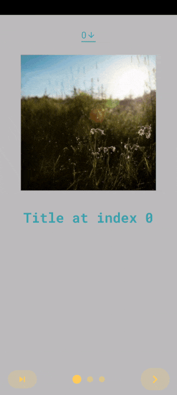
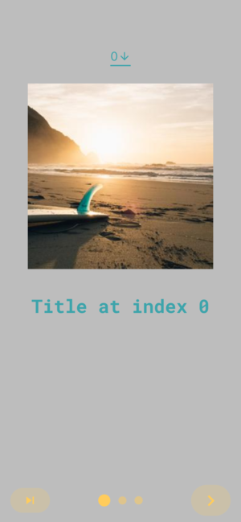

<h1 align="center">FLUTTER INTRO SLIDER</h1>

<p align="center">Flutter Intro Slider is a flutter plugin that helps you make a cool intro for your app. Create intro has never been easier and faster</p>

## Table of Contents

- [Installing](#installing) - How to install
- [Demo](#demo) - How this plugin works
- [Code example](#code-example) - How to use
  - [Default config](#default-config)
  - [Custom config](#custom-config)
  - [Custom layout](#custom-layout)
- [IntroSlider parameter](#introslider-parameter) - Modifying frame slider (next, done btn, scroll behavior...)
- [ContentConfig parameter](#contentconfig-parameter) - Modifying contents (title, image, description...)
- [IndicatorConfig parameter](#indicatorconfig-parameter) - Custom indicator
- [NavigationBarConfig parameter](#navigationbarconfig-parameter) - Custom position navigation bar

<br>

## Installing

Add to pubspec.yaml file

```sh
dependencies:
  intro_slider: ^4.2.2
```

Import

```sh
import 'package:intro_slider/intro_slider.dart';
```

<br>

## Demo

  

<br>

## Code example

<br>

### Default config


<details>
  <summary>Code example (click to expand)</summary>
  
```dart
class IntroScreenDefaultState extends State<IntroScreenDefault> {
  List<ContentConfig> listContentConfig = [];

  @override
  void initState() {
    super.initState();

    listContentConfig.add(
      const ContentConfig(
        title: "ERASER",
        description:
            "Allow miles wound place the leave had. To sitting subject no improve studied limited",
        pathImage: "images/photo_eraser.png",
        backgroundColor: Color(0xfff5a623),
      ),
    );
    listContentConfig.add(
      const ContentConfig(
        title: "PENCIL",
        description:
            "Ye indulgence unreserved connection alteration appearance",
        pathImage: "images/photo_pencil.png",
        backgroundColor: Color(0xff203152),
      ),
    );
    listContentConfig.add(
      const ContentConfig(
        title: "RULER",
        description:
            "Much evil soon high in hope do view. Out may few northward believing attempted. Yet timed being songs marry one defer men our. Although finished blessing do of",
        pathImage: "images/photo_ruler.png",
        backgroundColor: Color(0xff9932CC),
      ),
    );
  }

  void onDonePress() {
    log("End of slides");
  }

  @override
  Widget build(BuildContext context) {
    return IntroSlider(
      key: UniqueKey(),
      listContentConfig: listContentConfig,
      onDonePress: onDonePress,
    );
  }
}
````

</details>

<br>

### Custom config


<details>
  <summary>Code example (click to expand)</summary>

```dart
class IntroScreenCustomConfigState extends State<IntroScreenCustomConfig> {
  List<ContentConfig> listContentConfig = [];
  Color activeColor = const Color(0xff0BEEF9);
  Color inactiveColor = const Color(0xff03838b);
  double sizeIndicator = 20;

  @override
  void initState() {
    super.initState();

    listContentConfig.add(
      ContentConfig(
        title:
            "A VERY LONG TITLE A VERY LONG TITLE A VERY LONG TITLE A VERY LONG TITLE A VERY LONG TITLE A VERY LONG TITLE A VERY LONG TITLE A VERY LONG TITLE A VERY LONG TITLE",
        maxLineTitle: 2,
        styleTitle: const TextStyle(
          color: Colors.white,
          fontSize: 30.0,
          fontWeight: FontWeight.bold,
          fontFamily: 'RobotoMono',
        ),
        description:
            "Lorem ipsum dolor sit amet, consectetuer adipiscing elit. Aenean commodo ligula eget dolor. Aenean massa. Cum sociis natoque penatibus et magnis dis parturient montes, nascetur ridiculus mus. Donec quam felis, ultricies nec, pellentesque eu, pretium quis, sem. Nulla consequat massa quis enim. Donec pede justo, fringilla vel, aliquet nec, vulputate eget, arcu. In enim justo, rhoncus ut, imperdiet a, venenatis vitae, justo. Nullam dictum felis eu pede mollis pretium. Integer tincidunt. Cras dapibus. Vivamus elementum semper nisi. Aenean vulputate eleifend tellus. Aenean leo ligula, porttitor eu, consequat vitae, eleifend ac, enim. Aliquam lorem ante, dapibus in, viverra quis, feugiat a, tellus. Phasellus viverra nulla ut metus varius laoreet. Quisque rutrum. Aenean imperdiet. Etiam ultricies nisi vel augue. Curabitur ullamcorper ultricies nisi. Nam eget dui. Etiam rhoncus. Maecenas tempus, tellus eget condimentum rhoncus, sem quam semper libero, sit amet adipiscing sem neque sed ipsum. Nam quam nunc, blandit vel, luctus pulvinar, hendrerit id, lorem. Maecenas nec odio et ante tincidunt tempus. Donec vitae sapien ut libero venenatis faucibus. Nullam quis ante. Etiam sit amet orci eget eros faucibus tincidunt. Duis leo. Sed fringilla mauris sit amet nibh. Donec sodales sagittis magna. Sed consequat, leo eget bibendum sodales, augue velit cursus nunc,",
        styleDescription: const TextStyle(
          color: Colors.white,
          fontSize: 20.0,
          fontStyle: FontStyle.italic,
          fontFamily: 'Raleway',
        ),
        marginDescription: const EdgeInsets.only(
          left: 20.0,
          right: 20.0,
          top: 20.0,
          bottom: 70.0,
        ),
        centerWidget: const Text(
          "Replace this with a custom widget",
          style: TextStyle(color: Colors.white),
        ),
        backgroundNetworkImage: "https://picsum.photos/600/900",
        backgroundFilterOpacity: 0.5,
        backgroundFilterColor: Colors.redAccent,
        onCenterItemPress: () {},
      ),
    );
    listContentConfig.add(
      const ContentConfig(
        title: "CITY",
        styleTitle: TextStyle(
          color: Color(0xff7FFFD4),
          fontSize: 30.0,
          fontWeight: FontWeight.bold,
          fontFamily: 'RobotoMono',
        ),
        description:
            "Ye indulgence unreserved connection alteration appearance",
        styleDescription: TextStyle(
          color: Color(0xff7FFFD4),
          fontSize: 20.0,
          fontStyle: FontStyle.italic,
          fontFamily: 'Raleway',
        ),
        colorBegin: Color(0xff89D4CF),
        colorEnd: Color(0xff734AE8),
        directionColorBegin: Alignment.topRight,
        directionColorEnd: Alignment.bottomLeft,
      ),
    );
    listContentConfig.add(
      const ContentConfig(
        title: "BEACH",
        styleTitle: TextStyle(
          color: Color(0xffFFDAB9),
          fontSize: 30.0,
          fontWeight: FontWeight.bold,
          fontFamily: 'RobotoMono',
        ),
        description:
            "Much evil soon high in hope do view. Out may few northward believing attempted. Yet timed being songs marry one defer men our. Although finished blessing do of",
        styleDescription: TextStyle(
          color: Color(0xffFFDAB9),
          fontSize: 20.0,
          fontStyle: FontStyle.italic,
          fontFamily: 'Raleway',
        ),
        backgroundImage: "images/beach.jpeg",
        maxLineTextDescription: 3,
      ),
    );
  }

  void onDonePress() {
    log("onDonePress caught");
  }

  void onNextPress() {
    log("onNextPress caught");
  }

  Widget renderNextBtn() {
    return const Icon(
      Icons.navigate_next,
      size: 25,
    );
  }

  Widget renderDoneBtn() {
    return const Icon(
      Icons.done,
      size: 25,
    );
  }

  Widget renderSkipBtn() {
    return const Icon(
      Icons.skip_next,
      size: 25,
    );
  }

  ButtonStyle myButtonStyle() {
    return ButtonStyle(
      shape: MaterialStateProperty.all<OutlinedBorder>(const StadiumBorder()),
      foregroundColor: MaterialStateProperty.all<Color>(activeColor),
      backgroundColor: MaterialStateProperty.all<Color>(inactiveColor),
    );
  }

  @override
  Widget build(BuildContext context) {
    return IntroSlider(
      key: UniqueKey(),
      // Content config
      listContentConfig: listContentConfig,
      backgroundColorAllTabs: Colors.grey,

      // Skip button
      renderSkipBtn: renderSkipBtn(),
      skipButtonStyle: myButtonStyle(),

      // Next button
      renderNextBtn: renderNextBtn(),
      onNextPress: onNextPress,
      nextButtonStyle: myButtonStyle(),

      // Done button
      renderDoneBtn: renderDoneBtn(),
      onDonePress: onDonePress,
      doneButtonStyle: myButtonStyle(),

      // Indicator
      indicatorConfig: IndicatorConfig(
        sizeIndicator: sizeIndicator,
        indicatorWidget: Container(
          width: sizeIndicator,
          height: 10,
          decoration: BoxDecoration(
              borderRadius: BorderRadius.circular(4), color: inactiveColor),
        ),
        activeIndicatorWidget: Container(
          width: sizeIndicator,
          height: 10,
          decoration: BoxDecoration(
              borderRadius: BorderRadius.circular(4), color: activeColor),
        ),
        spaceBetweenIndicator: 10,
        typeIndicatorAnimation: TypeIndicatorAnimation.sliding,
      ),

      // Navigation bar
      navigationBarConfig: NavigationBarConfig(
        navPosition: NavPosition.bottom,
        padding: EdgeInsets.only(
          top: MediaQuery.of(context).viewPadding.top > 0 ? 20 : 10,
          bottom: MediaQuery.of(context).viewPadding.bottom > 0 ? 20 : 10,
        ),
        backgroundColor: Colors.black.withOpacity(0.5),
      ),

      // Scroll behavior
      isAutoScroll: true,
      isLoopAutoScroll: true,
      curveScroll: Curves.bounceIn,
    );
  }
}
````

</details>

<br>

### Custom layout



<details>
  <summary>Code example (click to expand)</summary>

```dart
class IntroScreenCustomLayoutState extends State<IntroScreenCustomLayout> {
  late Function goToTab;

  Color primaryColor = const Color(0xffffcc5c);
  Color secondColor = const Color(0xff3da4ab);

  void onDonePress() {
    goToTab(0);
  }

  void onTabChangeCompleted(index) {
    log("onTabChangeCompleted, index: $index");
  }

  Widget renderNextBtn() {
    return Icon(
      Icons.navigate_next,
      color: primaryColor,
      size: 35.0,
    );
  }

  Widget renderDoneBtn() {
    return Icon(
      Icons.done,
      color: primaryColor,
    );
  }

  Widget renderSkipBtn() {
    return Icon(
      Icons.skip_next,
      color: primaryColor,
    );
  }

  ButtonStyle myButtonStyle() {
    return ButtonStyle(
      shape: MaterialStateProperty.all<OutlinedBorder>(const StadiumBorder()),
      backgroundColor:
          MaterialStateProperty.all<Color>(const Color(0x33ffcc5c)),
      overlayColor: MaterialStateProperty.all<Color>(const Color(0x33ffcc5c)),
    );
  }

  List<Widget> generateListCustomTabs() {
    return List.generate(
      3,
      (index) => Container(
        color: Colors.black26,
        width: double.infinity,
        height: double.infinity,
        child: ListView(
          children: <Widget>[
            const SizedBox(height: 20),
            Center(
              child: DropdownButton<String>(
                value: index.toString(),
                icon: Icon(Icons.arrow_downward, color: secondColor, size: 20),
                elevation: 16,
                style: TextStyle(color: primaryColor),
                underline: Container(
                  height: 2,
                  color: secondColor,
                ),
                onChanged: (String? value) {},
                items: ["0", "1", "2"]
                    .map<DropdownMenuItem<String>>((String value) {
                  return DropdownMenuItem<String>(
                    value: value,
                    child: Text(value,
                        style: TextStyle(color: secondColor, fontSize: 20)),
                  );
                }).toList(),
              ),
            ),
            const SizedBox(height: 20),
            Image.network(
              "https://picsum.photos/${300 + index}",
              width: 300.0,
              height: 300.0,
            ),
            const SizedBox(height: 20),
            Container(
              margin: const EdgeInsets.symmetric(vertical: 20, horizontal: 16),
              child: Text(
                "Title at index $index",
                textAlign: TextAlign.center,
                style: TextStyle(
                  color: secondColor,
                  fontSize: 30.0,
                  fontWeight: FontWeight.bold,
                  fontFamily: 'RobotoMono',
                ),
              ),
            ),
          ],
        ),
      ),
    );
  }

  @override
  Widget build(BuildContext context) {
    return IntroSlider(
      key: UniqueKey(),
      // Skip button
      renderSkipBtn: renderSkipBtn(),
      skipButtonStyle: myButtonStyle(),

      // Next button
      renderNextBtn: renderNextBtn(),
      nextButtonStyle: myButtonStyle(),

      // Done button
      renderDoneBtn: renderDoneBtn(),
      onDonePress: onDonePress,
      doneButtonStyle: myButtonStyle(),

      // Indicator
      indicatorConfig: const IndicatorConfig(
        colorIndicator: Color(0xffffcc5c),
        sizeIndicator: 13.0,
        typeIndicatorAnimation: TypeIndicatorAnimation.sizeTransition,
      ),

      // Custom tabs
      listCustomTabs: generateListCustomTabs(),
      backgroundColorAllTabs: Colors.white,
      refFuncGoToTab: (refFunc) {
        goToTab = refFunc;
      },

      // Behavior
      scrollPhysics: const BouncingScrollPhysics(),
      onTabChangeCompleted: onTabChangeCompleted,
    );
  }
}
```

</details>

<br><br>

## IntroSlider parameter

| Name                   | Type                                | Default                                        | Description                                                                                       |
| ---------------------- | ----------------------------------- | ---------------------------------------------- | ------------------------------------------------------------------------------------------------- |
| <b>Tab</b>             |                                     |                                                |                                                                                                   |
| key                    | `Key?`                              |                                                | Assign key to IntroSlider widget                                                                  |
| listContentConfig      | `List<ContentConfig>?`              | [View details](#contentconfig-parameter)       | An array of ContentConfig, require if *listCustomTabs* not defined                                |
| listCustomTabs         | `List<Widget>?`                     | Require if *listContentConfig* not defined     | Render your own widget list tabs (meaning you can put your custom widget into the prebuilt frame) |
| refFuncGoToTab         | `void Function(Function function)?` | Do nothing                                     | Send the reference of change tab's function, then we can move to any tab index programmatically   |
| onTabChangeCompleted   | `void Function(int index)?`         | Do nothing                                     | Callback when tab change comleted, return the current tab's index                                 |
| backgroundColorAllTabs | `Color?`                            | Transparent                                    | Background color for all tabs (if backgroundColor not set in each tab)                            |
| <b>Skip Button</b>     |                                     |                                                |                                                                                                   |
| renderSkipBtn          | `Widget?`                           | Text("SKIP")                                   | Render your own widget SKIP button                                                                |
| skipButtonStyle        | `ButtonStyle?`                      | ButtonStyle()                                  | Style for SKIP button                                                                             |
| onSkipPress            | `void Function()?`                  | Go to last page + call your function if define | Fire when press SKIP button                                                                       |
| isShowSkipBtn          | `bool?`                             | true                                           | Show or hide SKIP button                                                                          |
| skipButtonKey          | `Key?`                              |                                                | Assign key to SKIP button                                                                         |
| <b>Previous Button</b> |                                     |                                                |                                                                                                   |
| renderPrevBtn          | `Widget?`                           | Text("PREV")                                   | Render your own PREV button                                                                       |
| prevButtonStyle        | `ButtonStyle?`                      | ButtonStyle()                                  | Style for PREV button                                                                             |
| isShowPrevBtn          | `bool?`                             | false                                          | Show or hide PREV, have to set isShowSkipBtn to false at first if you want to show this button    |
| prevButtonKey          | `Key?`                              |                                                | Assign key to PREV button                                                                         |
| <b>Done Button</b>     |                                     |                                                |                                                                                                   |
| renderDoneBtn          | `Widget?`                           | Text("DONE")                                   | Render your own DONE button                                                                       |
| doneButtonStyle        | `ButtonStyle?`                      | ButtonStyle()                                  | Style for DONE button                                                                             |
| onDonePress            | `void Function()?`                  | Do nothing                                     | Fire when press DONE button                                                                       |
| isShowDoneBtn          | `bool?`                             | true                                           | Show or hide DONE button                                                                          |
| doneButtonKey          | `Key?`                              |                                                | Assign key to NEXT button                                                                         |
| <b>Next Button</b>     |                                     |                                                |                                                                                                   |
| renderNextBtn          | `Widget?`                           | Text("NEXT")                                   | Render your own NEXT button                                                                       |
| nextButtonStyle        | `ButtonStyle?`                      | ButtonStyle()                                  | Style for NEXT button                                                                             |
| onNextPress            | `void Function()?`                  | Go to next page + call your function if define | Fire when press NEXT button                                                                       |
| isShowNextBtn          | `bool?`                             | true                                           | Show or hide NEXT button                                                                          |
| nextButtonKey          | `Key?`                              |                                                | Assign key to NEXT button                                                                         |
| <b>Indicator</b>       |                                     |                                                |                                                                                                   |
| indicatorConfig        | `IndicatorConfig?`                  | [View details](#indicatorconfig-parameter)     | Custom indicator                                                                                  |
| <b>Navigation bar</b>  |                                     |                                                |                                                                                                   |
| navigationBarConfig    | `NavigationBarConfig?`              | [View details](#navigationbarconfig-parameter) | Custom position navigation bar                                                                    |
| <b>Scroll behavior</b> |                                     |                                                |                                                                                                   |
| isScrollable           | `bool?`                             | true                                           | Whether or not the slider is scrollable (or controlled only by buttons)                           |
| curveScroll            | `Curve?`                            | Curves.ease                                    | Set transition animation curves (also effect to indicator when it's sliding)                      |
| scrollPhysics          | `ScrollPhysics?`                    | ScrollPhysics()                                | Determines the physics horizontal scroll for the slides                                           |
| isAutoScroll           | `bool?`                             | false                                          | Enable auto scroll slides                                                                         |
| isLoopAutoScroll       | `bool?`                             | false                                          | Loop transition by go to first slide when reach the end                                           |
| isPauseAutoPlayOnTouch | `bool?`                             | true                                           | Auto scroll will be paused if user touch to slide                                                 |
| autoScrollInterval     | `Duration?`                         | Duration(seconds: 4)                           | Sets duration to determine the frequency of slides                                                |

<br>

## ContentConfig parameter

| Name                      | Type                      | Default                                 | Description                                                                                                                     |
| ------------------------- | ------------------------- | --------------------------------------- | ------------------------------------------------------------------------------------------------------------------------------- |
| <b>Title</b>              |                           |                                         |                                                                                                                                 |
| title                     | `String?`                 | ""                                      | Change text title at top                                                                                                        |
| widgetTitle               | `Widget?`                 | null                                    | Set a custom widget as the title (ignore `title` if define both)                                                                |
| maxLineTitle              | `int?`                    | 1                                       | Change max number of lines title at top                                                                                         |
| styleTitle                | `TextStyle?`              | White color, bold and font size is 30.0 | Style for text title                                                                                                            |
| textAlignTitle            | `TextAlign?`              | TextAlign.center                        | TextAlign for text title                                                                                                        |
| textOverFlowTitle         | `TextOverflow?`           | TextOverflow.ellipsis                   | TextOverflow for text title                                                                                                     |
| marginTitle               | `EdgeInsets?`             | top: 70.0, bottom: 50.0                 | Margin for text title                                                                                                           |
| <b>Image</b>              |                           |                                         |                                                                                                                                 |
| pathImage                 | `String?`                 | ""                                      | Path to your local image                                                                                                        |
| widthImage                | `double?`                 | 250.0                                   | Width of image                                                                                                                  |
| heightImage               | `double?`                 | 250.0                                   | Height of image                                                                                                                 |
| foregroundImageFit        | `BoxFit?`                 | BoxFit.contain                          | Foreground image fit                                                                                                            |
| <b>Center widget</b>      |                           |                                         |                                                                                                                                 |
| centerWidget              | `Widget?`                 | null                                    | Your custom's widget                                                                                                            |
| onCenterItemPress         | `Function()?`             | Do nothing                              | Fire when press center image/widget                                                                                             |
| <b>Description</b>        |                           |                                         |                                                                                                                                 |
| description               | `String?`                 | ""                                      | Change text description at bottom                                                                                               |
| widgetDescription         | `Widget?`                 | null                                    | Set a custom widget as the description (ignore `description` if define both)                                                    |
| maxLineTextDescription    | `int?`                    | 100                                     | Maximum line of text description                                                                                                |
| styleDescription          | `TextStyle?`              | White and font size is 18.0             | Style for text description                                                                                                      |
| textAlignDescription      | `TextAlign?`              | TextAlign.center                        | TextAlign for text description                                                                                                  |
| textOverFlowDescription   | `TextOverflow?`           | TextOverflow.ellipsis                   | TextOverflow for text description                                                                                               |
| marginDescription         | `EdgeInsets?`             | left, right = 20.0, top, bottom = 50.0  | Margin for text description                                                                                                     |
| <b>Background Color</b>   |                           |                                         |                                                                                                                                 |
| backgroundColor           | `Color?`                  | Colors.amberAccent                      | Background tab color (if set, will ignore gradient properties below)                                                            |
| colorBegin                | `Color?`                  | Colors.amberAccent                      | Gradient tab color begin                                                                                                        |
| colorEnd                  | `Color?`                  | Colors.amberAccent                      | Gradient tab color end                                                                                                          |
| directionColorBegin       | `AlignmentGeometry?`      | Alignment.topLeft                       | Direction color begin                                                                                                           |
| directionColorEnd         | `AlignmentGeometry?`      | Alignment.bottomRight                   | Direction color end                                                                                                             |
| <b>Background Image</b>   |                           |                                         |                                                                                                                                 |
| backgroundImage           | `String?`                 | null                                    | Set image for background (if set, will ignore all parameter at `Background Color` above)                                        |
| backgroundNetworkImage    | `String?`                 | null                                    | Set image (from network) for background                                                                                         |
| backgroundImageFit        | `BoxFit?`                 | BoxFit.cover                            | Background image fit                                                                                                            |
| backgroundFilterColor     | `Color?`                  | Colors.black                            | A color filter to apply to the image background before painting it                                                              |
| backgroundFilterOpacity   | `double?`                 | 0.5                                     | Opacity for `backgroundFilterColor`                                                                                             |
| backgroundBlendMode       | `BlendMode?`              | BlendMode.darken                        | Background blend mode                                                                                                           |
| <b>Others</b>             |                           |                                         |                                                                                                                                 |
| verticalScrollbarBehavior | `enum ScrollbarBehavior?` | ScrollbarBehavior.HIDE                  | Allow to specify how the vertical scrollbar should behave <br>(scroll enable when content length is greater than screen length) |

<br>

## IndicatorConfig parameter
| Name                   | Type                           | Default                         | Description                                                                                                     |
| ---------------------- | ------------------------------ | ------------------------------- | --------------------------------------------------------------------------------------------------------------- |
| isShowIndicator        | `bool?`                        | true                            | Show or hide indicator                                                                                          |
| colorIndicator         | `Color?`                       | Colors.black54                  | Color indicator when passive, note: ignore if using custom indicator                                            |
| colorActiveIndicator   | `Color?`                       | value of colorIndicator         | Color indicator when active (focusing), note: ignore if using custom indicator                                  |
| sizeIndicator          | `double?`                      | 8.0                             | Size of each indicator                                                                                          |
| spaceBetweenIndicator  | `double?`                      | The same value of sizeIndicator | Space between every indicator                                                                                   |
| typeIndicatorAnimation | `enum TypeIndicatorAnimation?` | TypeIndicatorAnimation.sliding  | Type indicator animation                                                                                        |
| indicatorWidget        | `Widget?`                      | Default dot                     | Your custom indicator widget                                                                                    |
| activeIndicatorWidget  | `Widget?`                      | Default dot                     | Your custom active (focusing) indicator widget, <br>note: ignore if using TypeIndicatorAnimation.sizeTransition |

<br>

## NavigationBarConfig parameter
| Name            | Type          | Default                            | Description                               |
| --------------- | ------------- | ---------------------------------- | ----------------------------------------- |
| padding         | `EdgeInsets`  | EdgeInsets.symmetric(vertical: 10) | Padding                                   |
| navPosition     | `NavPosition` | NavPosition.bottom                 | Move navigation bar to top or bottom page |
| backgroundColor | `Color`       | Colors.transparent                 | Background color                          |

<br>

## Pull request and feedback are always appreciated
