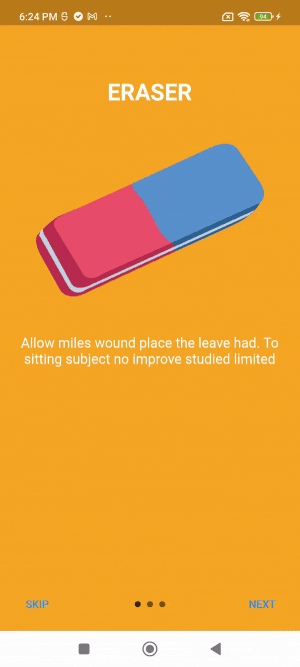

<h1 align="center">FLUTTER INTRO SLIDER</h1>

<p align="center">Flutter Intro Slider is a flutter plugin that helps you make a cool intro for your app. Create intro has never been easier and faster</p>

## Table of Contents

- [Installing](#installing) - How to install
- [Demo](#demo) - How this plugin works
- [Code example](#code-example) - How to use
  - [Default config](#default-config)
  - [Custom config](#custom-config)
  - [Custom your own tabs](#custom-your-own-tabs)
- [Slide object properties](#slide-object-properties) - Modifying your tabs
- [IntroSlider widget properties](#IntroSlider-widget-properties) - Modifying entire slider

## Installing

Add to pubspec.yaml file

```sh
dependencies:
  intro_slider: ^3.0.2
```

Import

```sh
import 'package:intro_slider/intro_slider.dart';
```

## Demo

  

## Code example

### Default config


<details>
  <summary>Code example (click to expand)</summary>
  
```dart
class IntroScreenState extends State<IntroScreen> {
  List<Slide> slides = [];

  @override
  void initState() {
    super.initState();

    slides.add(
      new Slide(
        title: "ERASER",
        description: "Allow miles wound place the leave had. To sitting subject no improve studied limited",
        pathImage: "images/photo_eraser.png",
        backgroundColor: Color(0xfff5a623),
      ),
    );
    slides.add(
      new Slide(
        title: "PENCIL",
        description: "Ye indulgence unreserved connection alteration appearance",
        pathImage: "images/photo_pencil.png",
        backgroundColor: Color(0xff203152),
      ),
    );
    slides.add(
      new Slide(
        title: "RULER",
        description:
            "Much evil soon high in hope do view. Out may few northward believing attempted. Yet timed being songs marry one defer men our. Although finished blessing do of",
        pathImage: "images/photo_ruler.png",
        backgroundColor: Color(0xff9932CC),
      ),
    );
  }

  void onDonePress() {
    // Do what you want
    print("End of slides");
  }

  @override
  Widget build(BuildContext context) {
    return new IntroSlider(
      slides: this.slides,
      onDonePress: this.onDonePress,
    );
  }
}
````

</details>

### Custom config


<details>
  <summary>Code example (click to expand)</summary>

```dart
class IntroScreenState extends State<IntroScreen> {
  List<Slide> slides = [];

  @override
  void initState() {
    super.initState();

    slides.add(
      new Slide(
        title:
            "A VERY LONG TITLE A VERY LONG TITLE A VERY LONG TITLE A VERY LONG TITLE A VERY LONG TITLE A VERY LONG TITLE A VERY LONG TITLE A VERY LONG TITLE A VERY LONG TITLE",
        maxLineTitle: 2,
        styleTitle:
            TextStyle(color: Colors.white, fontSize: 30.0, fontWeight: FontWeight.bold, fontFamily: 'RobotoMono'),
        description:
            "Lorem ipsum dolor sit amet, consectetuer adipiscing elit. Aenean commodo ligula eget dolor. Aenean massa. Cum sociis natoque penatibus et magnis dis parturient montes, nascetur ridiculus mus. Donec quam felis, ultricies nec, pellentesque eu, pretium quis, sem. Nulla consequat massa quis enim. Donec pede justo, fringilla vel, aliquet nec, vulputate eget, arcu. In enim justo, rhoncus ut, imperdiet a, venenatis vitae, justo. Nullam dictum felis eu pede mollis pretium. Integer tincidunt. Cras dapibus. Vivamus elementum semper nisi. Aenean vulputate eleifend tellus. Aenean leo ligula, porttitor eu, consequat vitae, eleifend ac, enim. Aliquam lorem ante, dapibus in, viverra quis, feugiat a, tellus. Phasellus viverra nulla ut metus varius laoreet. Quisque rutrum. Aenean imperdiet. Etiam ultricies nisi vel augue. Curabitur ullamcorper ultricies nisi. Nam eget dui. Etiam rhoncus. Maecenas tempus, tellus eget condimentum rhoncus, sem quam semper libero, sit amet adipiscing sem neque sed ipsum. Nam quam nunc, blandit vel, luctus pulvinar, hendrerit id, lorem. Maecenas nec odio et ante tincidunt tempus. Donec vitae sapien ut libero venenatis faucibus. Nullam quis ante. Etiam sit amet orci eget eros faucibus tincidunt. Duis leo. Sed fringilla mauris sit amet nibh. Donec sodales sagittis magna. Sed consequat, leo eget bibendum sodales, augue velit cursus nunc,",
        styleDescription:
            TextStyle(color: Colors.white, fontSize: 20.0, fontStyle: FontStyle.italic, fontFamily: 'Raleway'),
        marginDescription: EdgeInsets.only(left: 20.0, right: 20.0, top: 20.0, bottom: 70.0),
        centerWidget: Text("Replace this with a custom widget", style: TextStyle(color: Colors.white)),
        backgroundImage: "images/forest.png",
        directionColorBegin: Alignment.topLeft,
        directionColorEnd: Alignment.bottomRight,
        onCenterItemPress: () {},
      ),
    );
    slides.add(
      new Slide(
        title: "CITY",
        styleTitle:
            TextStyle(color: Color(0xff7FFFD4), fontSize: 30.0, fontWeight: FontWeight.bold, fontFamily: 'RobotoMono'),
        description: "Ye indulgence unreserved connection alteration appearance",
        styleDescription:
            TextStyle(color: Color(0xff7FFFD4), fontSize: 20.0, fontStyle: FontStyle.italic, fontFamily: 'Raleway'),
        backgroundImage: "images/city.jpeg",
        directionColorBegin: Alignment.topRight,
        directionColorEnd: Alignment.bottomLeft,
      ),
    );
    slides.add(
      new Slide(
        title: "BEACH",
        styleTitle:
            TextStyle(color: Color(0xffFFDAB9), fontSize: 30.0, fontWeight: FontWeight.bold, fontFamily: 'RobotoMono'),
        description:
            "Much evil soon high in hope do view. Out may few northward believing attempted. Yet timed being songs marry one defer men our. Although finished blessing do of",
        styleDescription:
            TextStyle(color: Color(0xffFFDAB9), fontSize: 20.0, fontStyle: FontStyle.italic, fontFamily: 'Raleway'),
        backgroundImage: "images/beach.jpeg",
        directionColorBegin: Alignment.topCenter,
        directionColorEnd: Alignment.bottomCenter,
        maxLineTextDescription: 3,
      ),
    );
  }

  void onDonePress() {
    // Do what you want
    // Navigator.push(
    //   context,
    //   MaterialPageRoute(builder: (context) => HomeScreen()),
    // );
  }

  Widget renderNextBtn() {
    return Icon(
      Icons.navigate_next,
      color: Color(0xffF3B4BA),
      size: 35.0,
    );
  }

  Widget renderDoneBtn() {
    return Icon(
      Icons.done,
      color: Color(0xffF3B4BA),
    );
  }

  Widget renderSkipBtn() {
    return Icon(
      Icons.skip_next,
      color: Color(0xffF3B4BA),
    );
  }

  ButtonStyle myButtonStyle() {
    return ButtonStyle(
      shape: MaterialStateProperty.all<OutlinedBorder>(StadiumBorder()),
      backgroundColor: MaterialStateProperty.all<Color>(Color(0x33F3B4BA)),
      overlayColor: MaterialStateProperty.all<Color>(Color(0x33FFA8B0)),
    );
  }

  @override
  Widget build(BuildContext context) {
    return new IntroSlider(
      // List slides
      slides: this.slides,

      // Skip button
      renderSkipBtn: this.renderSkipBtn(),
      skipButtonStyle: myButtonStyle(),

      // Next button
      renderNextBtn: this.renderNextBtn(),
      nextButtonStyle: myButtonStyle(),

      // Done button
      renderDoneBtn: this.renderDoneBtn(),
      onDonePress: this.onDonePress,
      doneButtonStyle: myButtonStyle(),

      // Dot indicator
      colorDot: Color(0x33FFA8B0),
      colorActiveDot: Color(0xffFFA8B0),
      sizeDot: 13.0,

      // Show or hide status bar
      hideStatusBar: true,
      backgroundColorAllSlides: Colors.grey,

      // Scrollbar
      verticalScrollbarBehavior: scrollbarBehavior.SHOW_ALWAYS,
    );
  }
}
````

</details>

### Custom your own tabs


<details>
  <summary>Code example (click to expand)</summary>

```dart
class IntroScreenState extends State<IntroScreen> {
  List<Slide> slides = [];

  Function goToTab;

  @override
  void initState() {
    super.initState();

    slides.add(
      new Slide(
        title: "SCHOOL",
        styleTitle: TextStyle(
          color: Color(0xff3da4ab),
          fontSize: 30.0,
          fontWeight: FontWeight.bold,
          fontFamily: 'RobotoMono',
        ),
        description:
            "Lorem ipsum dolor sit amet, consectetuer adipiscing elit. Aenean commodo ligula eget dolor. Aenean massa.",
        styleDescription:
            TextStyle(color: Color(0xfffe9c8f), fontSize: 20.0, fontStyle: FontStyle.italic, fontFamily: 'Raleway'),
        pathImage: "images/photo_school.png",
      ),
    );
    slides.add(
      new Slide(
        title: "MUSEUM",
        styleTitle:
            TextStyle(color: Color(0xff3da4ab), fontSize: 30.0, fontWeight: FontWeight.bold, fontFamily: 'RobotoMono'),
        description: "Ye indulgence unreserved connection alteration appearance",
        styleDescription:
            TextStyle(color: Color(0xfffe9c8f), fontSize: 20.0, fontStyle: FontStyle.italic, fontFamily: 'Raleway'),
        pathImage: "images/photo_museum.png",
      ),
    );
    slides.add(
      new Slide(
        title: "COFFEE SHOP",
        styleTitle:
            TextStyle(color: Color(0xff3da4ab), fontSize: 30.0, fontWeight: FontWeight.bold, fontFamily: 'RobotoMono'),
        description:
            "Much evil soon high in hope do view. Out may few northward believing attempted. Yet timed being songs marry one defer men our. Although finished blessing do of",
        styleDescription:
            TextStyle(color: Color(0xfffe9c8f), fontSize: 20.0, fontStyle: FontStyle.italic, fontFamily: 'Raleway'),
        pathImage: "images/photo_coffee_shop.png",
      ),
    );
  }

  void onDonePress() {
    // Back to the first tab
    this.goToTab(0);
  }

  void onTabChangeCompleted(index) {
    // Index of current tab is focused
    print(index);
  }

  Widget renderNextBtn() {
    return Icon(
      Icons.navigate_next,
      color: Color(0xffffcc5c),
      size: 35.0,
    );
  }

  Widget renderDoneBtn() {
    return Icon(
      Icons.done,
      color: Color(0xffffcc5c),
    );
  }

  Widget renderSkipBtn() {
    return Icon(
      Icons.skip_next,
      color: Color(0xffffcc5c),
    );
  }

  ButtonStyle myButtonStyle() {
    return ButtonStyle(
      shape: MaterialStateProperty.all<OutlinedBorder>(StadiumBorder()),
      backgroundColor: MaterialStateProperty.all<Color>(Color(0x33ffcc5c)),
      overlayColor: MaterialStateProperty.all<Color>(Color(0x33ffcc5c)),
    );
  }

  List<Widget> renderListCustomTabs() {
    List<Widget> tabs = [];
    for (int i = 0; i < slides.length; i++) {
      Slide currentSlide = slides[i];
      tabs.add(Container(
        width: double.infinity,
        height: double.infinity,
        child: Container(
          margin: EdgeInsets.only(bottom: 60.0, top: 60.0),
          child: ListView(
            children: <Widget>[
              GestureDetector(
                  child: Image.asset(
                currentSlide.pathImage,
                width: 200.0,
                height: 200.0,
                fit: BoxFit.contain,
              )),
              Container(
                child: Text(
                  currentSlide.title,
                  style: currentSlide.styleTitle,
                  textAlign: TextAlign.center,
                ),
                margin: EdgeInsets.only(top: 20.0),
              ),
              Container(
                child: Text(
                  currentSlide.description,
                  style: currentSlide.styleDescription,
                  textAlign: TextAlign.center,
                  maxLines: 5,
                  overflow: TextOverflow.ellipsis,
                ),
                margin: EdgeInsets.only(top: 20.0),
              ),
            ],
          ),
        ),
      ));
    }
    return tabs;
  }

  @override
  Widget build(BuildContext context) {
    return new IntroSlider(
      // Skip button
      renderSkipBtn: this.renderSkipBtn(),
      skipButtonStyle: myButtonStyle(),

      // Next button
      renderNextBtn: this.renderNextBtn(),
      nextButtonStyle: myButtonStyle(),

      // Done button
      renderDoneBtn: this.renderDoneBtn(),
      onDonePress: this.onDonePress,
      doneButtonStyle: myButtonStyle(),

      // Dot indicator
      colorDot: Color(0xffffcc5c),
      sizeDot: 13.0,
      typeDotAnimation: dotSliderAnimation.SIZE_TRANSITION,

      // Tabs
      listCustomTabs: this.renderListCustomTabs(),
      backgroundColorAllSlides: Colors.white,
      refFuncGoToTab: (refFunc) {
        this.goToTab = refFunc;
      },

      // Behavior
      scrollPhysics: BouncingScrollPhysics(),

      // Show or hide status bar
      hideStatusBar: true,

      // On tab change completed
      onTabChangeCompleted: this.onTabChangeCompleted,
    );
  }
}
```

</details>

## Slide object properties

| Name                    | Type                 | Default                                 | Description                                                                  |
| ----------------------- | -------------------- | --------------------------------------- | ---------------------------------------------------------------------------- |
| <b>Title</b>            |                      |                                         |                                                                              |
| title                   | `String?`            | ""                                      | Change text title at top                                                     |
| widgetTitle             | `Widget?`            | null                                    | Set a custom widget as the title (ignore `title` if define both)             |
| maxLineTitle            | `int?`               | 1                                       | Change max number of lines title at top                                      |
| styleTitle              | `TextStyle?`         | White color, bold and font size is 30.0 | Style for text title                                                         |
| marginTitle             | `EdgeInsets?`        | top: 70.0, bottom: 50.0                 | Margin for text title                                                        |
| <b>Image</b>            |                      |                                         |                                                                              |
| pathImage               | `String?`            | ""                                      | Path to your local image                                                     |
| widthImage              | `double?`            | 250.0                                   | Width of image                                                               |
| heightImage             | `double?`            | 250.0                                   | Height of image                                                              |
| foregroundImageFit      | `BoxFit?`            | BoxFit.contain                          | Foreground image fit                                                         |
| <b>Center widget</b>    |                      |                                         |                                                                              |
| centerWidget            | `Widget?`            | null                                    | Your custom's widget                                                         |
| onCenterItemPress       | `Function()?`        | Do nothing                              | Fire when press center image/widget                                          |
| <b>Description</b>      |                      |                                         |                                                                              |
| description             | `String?`            | ""                                      | Change text description at bottom                                            |
| widgetDescription       | `Widget?`            | null                                    | Set a custom widget as the description (ignore `description` if define both) |
| maxLineTextDescription  | `int?`               | 100                                     | Maximum line of text description                                             |
| styleDescription        | `TextStyle?`         | White and font size is 18.0             | Style for text description                                                   |
| marginDescription       | `EdgeInsets?`        | left, right = 20.0, top, bottom = 50.0  | Margin for text description                                                  |
| <b>Background Color</b> |                      |                                         |                                                                              |
| backgroundColor         | `Color?`             | Colors.amberAccent                      | Background tab color                                                         |
| colorBegin              | `Color?`             | Colors.amberAccent                      | Gradient tab color begin                                                     |
| colorEnd                | `Color?`             | Colors.amberAccent                      | Gradient tab color end                                                       |
| directionColorBegin     | `AlignmentGeometry?` | Alignment.topLeft                       | Direction color begin                                                        |
| directionColorEnd       | `AlignmentGeometry?` | Alignment.bottomRight                   | Direction color end                                                          |
| <b>Background Image</b> |                      |                                         |                                                                              |
| backgroundImage         | `String?`            | null                                    | Background tab image                                                         |
| backgroundImageFit      | `BoxFit?`            | BoxFit.cover                            | Background tab image fit                                                     |
| backgroundOpacity       | `double?`            | 0.5                                     | Background tab image filter opacity                                          |
| backgroundOpacityColor  | `Color?`             | Colors.black                            | Background tab image filter color                                            |
| backgroundBlendMode     | `BlendMode?`         | BlendMode.darken                        | Background tab image filter blend mode                                       |

## IntroSlider widget properties

| Name                                                                                                   | Type                                | Default                                           | Description                                                                                         |
| ------------------------------------------------------------------------------------------------------ | ----------------------------------- | ------------------------------------------------- | --------------------------------------------------------------------------------------------------- |
| <b>Slide</b>                                                                                           |                                     |                                                   |                                                                                                     |
| slides                                                                                                 | `Slide`                             | No default, require if listCustomTabs not defined | An array of Slide object                                                                            |
| <b>Skip Button</b>                                                                                     |                                     |                                                   |                                                                                                     |
| renderSkipBtn                                                                                          | `Widget?`                           | Button with white text SKIP                       | Render your own widget SKIP button                                                                  |
| skipButtonStyle                                                                                        | `ButtonStyle?`                      | ButtonStyle()                                     | Style for SKIP button                                                                               |
| onSkipPress                                                                                            | `void Function()?`                  | Go to last page                                   | Fire when press SKIP button                                                                         |
| skipButtonStyle                                                                                        | `ButtonStyle?`                      | ButtonStyle()                                     | Style for SKIP button                                                                               |
| showSkipBtn                                                                                            | `bool?`                             | true                                              | Show or hide SKIP button                                                                            |
| <b>Previous Button</b>                                                                                 |                                     |                                                   |                                                                                                     |
| renderPrevBtn                                                                                          | `Widget?`                           | Button with white text PREV                       | Render your own PREV button                                                                         |
| prevButtonStyle                                                                                        | `ButtonStyle?`                      | ButtonStyle()                                     | Style for PREV button                                                                               |
| showPrevBtn                                                                                            | `bool?`                             | false                                             | Show or hide PREV, have to set showSkipBtn to false at first if you want to show this button        |
| <b>Done Button</b>                                                                                     |                                     |                                                   |                                                                                                     |
| renderDoneBtn                                                                                          | `Widget?`                           | Button with white text DONE                       | Render your own DONE button                                                                         |
| doneButtonStyle                                                                                        | `ButtonStyle?`                      | ButtonStyle()                                     | Style for DONE button                                                                               |
| onDonePress                                                                                            | `void Function()?`                  | Do nothing                                        | Fire when press DONE button                                                                         |
| showDoneBtn                                                                                            | `bool?`                             | true                                              | Show or hide DONE button                                                                            |
| <b>Next Button                                                                                         |                                     |                                                   |                                                                                                     |
| renderNextBtn                                                                                          | `Widget?`                           | Button with white text NEXT                       | Render your own NEXT button                                                                         |
| nextButtonStyle                                                                                        | `ButtonStyle?`                      | ButtonStyle()                                     | Style for NEXT button                                                                               |
| showNextBtn                                                                                            | `bool?`                             | true                                              | Show or hide NEXT button                                                                            |
| <b>Dot Indicator</b>                                                                                   |                                     |                                                   |                                                                                                     |
| showDotIndicator                                                                                       | `bool?`                             | true                                              | Show or hide dot indicator                                                                          |
| colorDot                                                                                               | `Color?`                            | Color(0x80000000)                                 | Color for dot when passive                                                                          |
| colorActiveDot                                                                                         | `Color?`                            | Color(0xffffffff)                                 | Color for dot when active                                                                           |
| sizeDot                                                                                                | `double?`                           | 8.0                                               | Size of each dot                                                                                    |
| typeDotAnimation (inactive dots auto have opacity 50%,<br/>dot active has size bigger than 1.5 times ) | `enum dotSliderAnimation?`          | dotSliderAnimation.DOT_MOVEMENT                   | Type dots animation                                                                                 |
| <b>Tabs</b>                                                                                            |                                     |                                                   |                                                                                                     |
| listCustomTabs                                                                                         | `List<Widget>?`                     | null                                              | Render your own list tabs (use default tab UI if not defined)                                       |
| refFuncGoToTab                                                                                         | `void Function(Function function)?` | Do nothing                                        | Send the reference of change tab's function,<br/>then we can move to any tab index programmatically |
| onTabChangeCompleted                                                                                   | `void Function(int index)?`         | Do nothing                                        | Callback when tab change comleted, return the current tab's index                                   |
| backgroundColorAllSlides                                                                               | `Color?`                            | Transparent                                       | Background color for all slides                                                                     |
| <b>Behavior</b>                                                                                        |                                     |                                                   |                                                                                                     |
| isScrollable                                                                                           | `bool?`                             | true                                              | Force button-only scrolling                                                                         |
| scrollPhysics                                                                                          | `ScrollPhysics?`                    | ScrollPhysics()                                   | Determines the physics horizontal scroll for the slide                                              |
| verticalScrollbarBehavior                                                                              | `enum scrollbarBehavior?`           | scrollbarBehavior.HIDE                            | Allow to specify how the vertical scrollbar should behave                                           |
| hideStatusBar                                                                                          | `bool?`                             | false                                             | Show or hide the status bar                                                                         |

## Pull request and feedback are always appreciated
